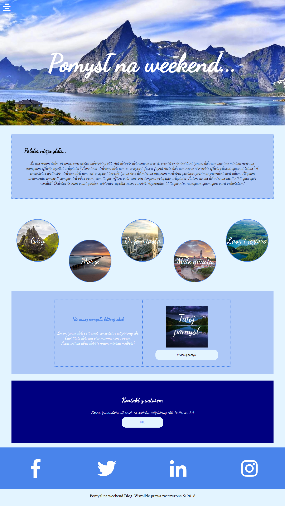
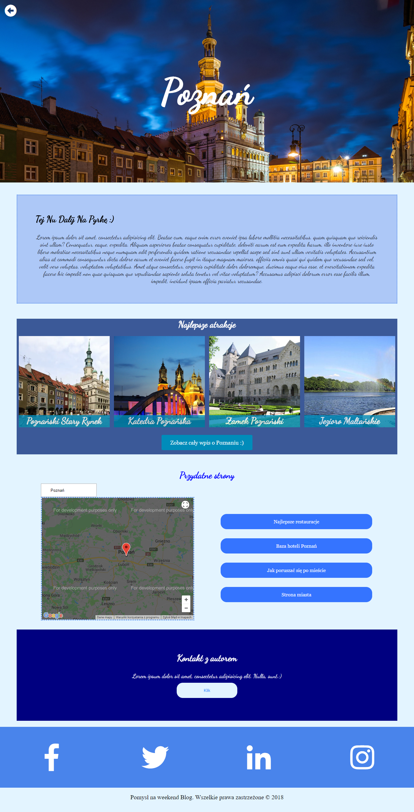
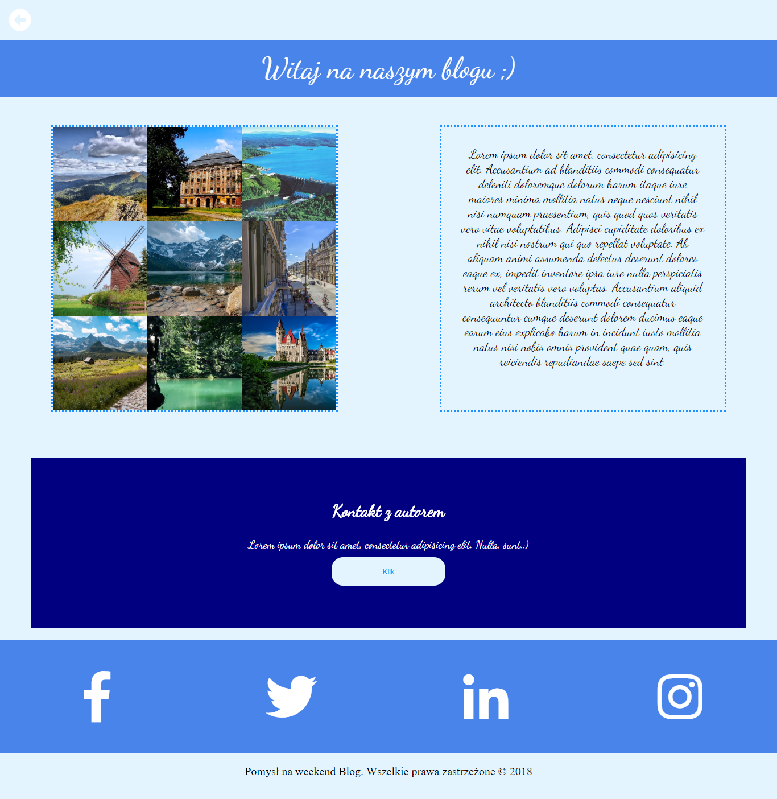

# CREATIVE WEEKEND - POMYSŁ NA WEEKEND

Creative weekend is a travel blog with creative ideas for weekend, which was created in React. It is my first project based on my own ideas. Thanks to this blog people will be able to plan a trip or holidays in a simple manner.The blog concerns mainly polish territory, because I would like to show people how beautiful is our country.

The project is still under construction, because it is a blog and I want to make it real good one.

### Technologies used:
* React
* CSS, CSS Animation

 
 
 

 

